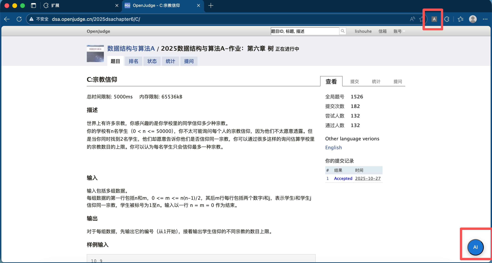
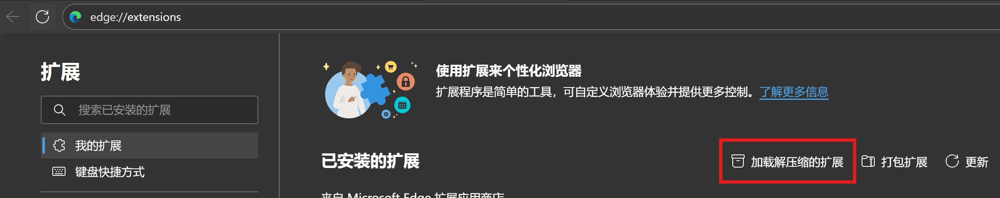
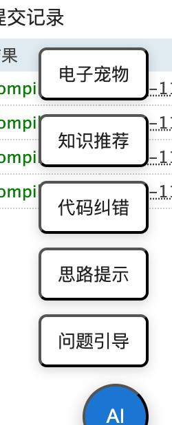
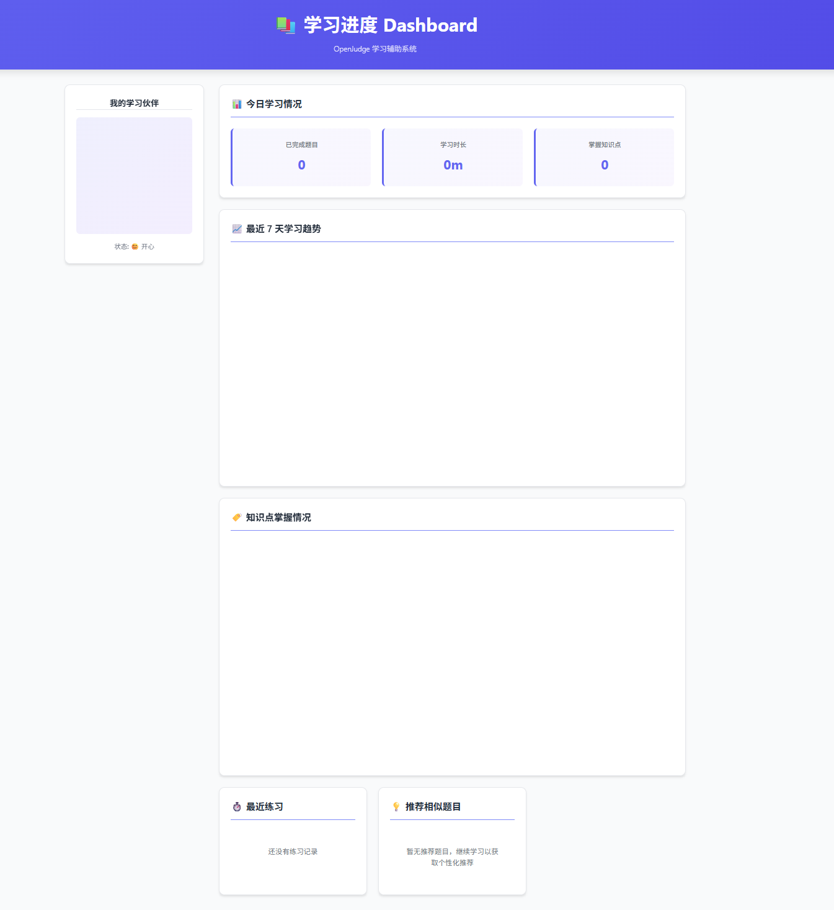

# Basic Framework

这个分支创建自@aidenlee2005在 https://github.com/LHS183019/team-project 的`main`分支上传的档案。大家可以在这个branch`development`的基础上创建自己的新分支(e.g. `development-popup`)来进行并行开发，后面再统一处理merge的问题~

下面转载了群里的一些环境设置说明和接口说明：

## 环境

在浏览器（是chrome插件框架，chrome、edge这些浏览器都可以，火狐好像也可以，safari不行）的设置就是在扩展界面打开开发者设置后添加本地扩展就可以，然后正常的话打开oj题目界面右下角就有一个悬浮窗按钮，然后右上角也会有一个点击的按钮可以跳转“学习进度”界面



### Edge配置



然后选择`bytemate`文件夹即可载入插件。


## 文件架构

```
ai-openjudge-helper/
│
├── manifest.json 
|
├── background/
│   └── background.js
│
├── content/
│   ├── content-script.js
│   ├── inject-ui.js
│   ├── ui.js
│   └── style.css
│
├── api/
│   ├── llm.js
│   ├── promptManager.js
│   ├── aiAssistant.js
│   └── storage.js
|
├── backend/
│   ├── .env.example
│   ├── llm-proxy.js
│   └── package.js
│
├── prompts/
│   ├── guide.txt
│   ├── idea.txt
│   ├── code_fix.txt
│   └── knowledge_tag.txt
│
├── dashboard/
│   ├── index.html
│   ├── index.js
│   ├── index.css
│   ├── charts.js
│   └── pet.js
│
├── popup/
│   ├── popup.html
│   ├── popup.js
│   └── popup.css
│
└── readme_assets/
    ├── asset1.png
    ├── asset2.png
    ├── asset3.png
    ├── ai_output.png
    └── pet/
        ├── pet_idle.json   (Lottie 动画或 gif)
        ├── pet_happy.json
        └── pet_sad.json
```

### 目录说明
**manifest.json** 插件入口声明文件（必备），定义权限、脚本注入、后台脚本等。

**background.js** 插件后台（Service Worker）
* 处理 content script 的消息
* 调用 LLM API（llm.js）
* 管理学习进度存储
* 控制 Dashboard 跳转

**content-script.js**  注入到 OpenJudge 页面：
* 获取题目标题、描述、代码内容
* 将 UI 注入网页
* 响应按钮点击 → 向后台发送消息

**inject-ui.js**  管理悬浮按钮、气泡提示、弹出窗口（让 UI 不与网站冲突）

**style.css**专为注入 UI 使用的样式，采用 shadow DOM 避免冲突

**llm.js** 封装大语言模型 API 通讯（OpenAI/DeepSeek/Zhipu/Qwen/Groq 任意可切换）

**.env.example** 存放url和API的位置，可以在这里选择使用的模型

**storage.js**  封装 chrome.storage
如：saveProgress(),getProgress(),updateKnowledgeTags(),updatePetStatus()

**prompts /** 存放所有用于 LLM 的 prompt 模板
* guide.txt → “问题引导”
* idea.txt → “思路提示”
* code_fix.txt → “代码纠错”
* knowledge_tag.txt → “知识点识别与分类”

**dashboard /** 插件自己的独立网页（Dashboard）
* index.html: 页面结构（iframe 不需要，独立页面即可）
* index.js: 主逻辑：
  * 加载用户学习记录
  * 加载知识点
  * 调用 charts.js 渲染图表
  * 调用 pet.js 渲染电子宠物
* index.css：Dashboard 的样式
* charts.js：封装图表绘制（Chart.js）

**popup /** 插件右上角小窗口（可选）
* 切换模型
* 输入 API key
* 查看今日学习情况
* 跳转 Dashboard 按钮

**assets /** 图标与宠物动画资源


## 当前`development`的进展(2025/11/14/12:11)

现在写了一个整体的框架，然后一些简单的前端设计和特别基础的交互功能已经可以实现，也可以爬取题目信息了，剩下就是一些LLM的部署、学习进度、相似题目推荐、（电子宠物）这些功能就要整合进来，以及还剩一些前端的设计需要做。

目前处理了下面三个按钮:



- **问题引导**: 按钮只在题目界面触发，返回题目信息；

- **思路提示**：只在编辑界面触发，返回题目信息&目前编辑的进度；

- **代码纠错**: 只在结果界面触发，返回题目信息&提交的代码&报错信息。

然后后续调用llm的时候就可以在这些json里面提取字段融进prompt里调用api就可以啦

我的这部分应该内容就这么多啦，后面要处理的应该就是：

1. LLM的api调用逻辑，以及api调用文本返回后的那个前端显示；
2. 学习进度收集（这个逻辑比较困难？） 以及相似题目的推荐
3. (2)这部分的前端设计（dashboard）
4. *宠物（这个要么先搁置吧感觉没啥时间？）

## 后端Json的返回格式

目前后端方面关于json的交互返回：

<details>
<summary>问题引导的返回</summary>

```json
{
  "feature": "guide",
  "pageType": "problem",
  "title": "C:文本二叉树",
  "statement": "如上图，一棵每个节点都是一个字母，且字母互不相同的二叉树，可以用以下若干行文本表示:\n\n\n\nA\n-B\n--*\n--C\n-D\n--E\n---*\n---F\n\n\n\n\n在这若干行文本中：\n\n1) 每个字母代表一个节点。该字母在文本中是第几行，就称该节点的行号是几。根在第1行\n2) 每个字母左边的'-'字符的个数代表该结点在树中的层次（树根位于第0层）\n3) 若某第 i 层的非根节点在文本中位于第n行，则其父节点必然是第 i-1 层的节点中，行号小于n,且行号与n的差最小的那个\n4) 若某文本中位于第n行的节点(层次是i) 有两个子节点，则第n+1行就是其左子节点，右子节点是n+1行以下第一个层次为i+1的节点\n5) 若某第 i 层的节点在文本中位于第n行，且其没有左子节点而有右子节点，那么它的下一行就是 i+1个'-' 字符再加上一个 '*'\n\n\n给出一棵树的文本表示法，要求输出该数的前序、后序、中序遍历结果",
  "samples": [
    {
      "input": "2\nA\n-B\n--*\n--C\n-D\n--E\n---*\n---F\n0\nA\n-B\n-C\n0",
      "output": ""
    },
    {
      "input": "ABCDEF\nCBFEDA\nBCAEFD\n\nABC\nBCA\nBAC",
      "output": ""
    }
  ],
  "currentCode": "",
  "tags": [],
  "problemId": "2721",
  "url": "http://dsa.openjudge.cn/2025dsachapter05/C/",
  "error": "",
  "_debug_source": "direct"
}
```
</details>


<details>
<summary>思路提示的返回</summary>

```json
{
  "feature": "hint",
  "pageType": "edit",
  "title": "C:文本二叉树",
  "statement": "如上图，一棵每个节点都是一个字母，且字母互不相同的二叉树，可以用以下若干行文本表示:\n\n\n\nA\n-B\n--*\n--C\n-D\n--E\n---*\n---F\n\n\n\n\n在这若干行文本中：\n\n1) 每个字母代表一个节点。该字母在文本中是第几行，就称该节点的行号是几。根在第1行\n2) 每个字母左边的'-'字符的个数代表该结点在树中的层次（树根位于第0层）\n3) 若某第 i 层的非根节点在文本中位于第n行，则其父节点必然是第 i-1 层的节点中，行号小于n,且行号与n的差最小的那个\n4) 若某文本中位于第n行的节点(层次是i) 有两个子节点，则第n+1行就是其左子节点，右子节点是n+1行以下第一个层次为i+1的节点\n5) 若某第 i 层的节点在文本中位于第n行，且其没有左子节点而有右子节点，那么它的下一行就是 i+1个'-' 字符再加上一个 '*'\n\n\n给出一棵树的文本表示法，要求输出该数的前序、后序、中序遍历结果",
  "samples": [
    {
      "input": "2\nA\n-B\n--*\n--C\n-D\n--E\n---*\n---F\n0\nA\n-B\n-C\n0",
      "output": ""
    },
    {
      "input": "ABCDEF\nCBFEDA\nBCAEFD\n\nABC\nBCA\nBAC",
      "output": ""
    }
  ],
  "currentCode": "int main(){\n...\n}",
  "tags": [],
  "problemId": "2721",
  "url": "/2025dsachapter05/C/",
  "error": "",
  "_debug_source": "direct"
}
```
</details>

<details>
<summary>代码纠错的返回</summary>

```json
{
  "feature": "fix",
  "pageType": "result",
  "title": "C:文本二叉树",
  "statement": "如上图，一棵每个节点都是一个字母，且字母互不相同的二叉树，可以用以下若干行文本表示:A-B--*--C-D--E---*---F在这若干行文本中：1) 每个字母代表一个节点。该字母在文本中是第几行，就称该节点的行号是几。根在第1行2) 每个字母左边的'-'字符的个数代表该结点在树中的层次（树根位于第0层）3) 若某第 i 层的非根节点在文本中位于第n行，则其父节点必然是第 i-1 层的节点中，行号小于n,且行号与n的差最小的那个4) 若某文本中位于第n行的节点(层次是i) 有两个子节点，则第n+1行就是其左子节点，右子节点是n+1行以下第一个层次为i+1的节点5) 若某第 i 层的节点在文本中位于第n行，且其没有左子节点而有右子节点，那么它的下一行就是 i+1个'-' 字符再加上一个 '*' 给出一棵树的文本表示法，要求输出该数的前序、后序、中序遍历结果",
  "samples": [
    {
      "input": "2\nA\n-B\n--*\n--C\n-D\n--E\n---*\n---F\n0\nA\n-B\n-C\n0",
      "output": ""
    },
    {
      "input": "ABCDEF\nCBFEDA\nBCAEFD\n\nABC\nBCA\nBAC",
      "output": ""
    }
  ],
  "currentCode": "int main(){\n...\n}",
  "tags": [],
  "problemId": "2721",
  "url": "http://dsa.openjudge.cn/2025dsachapter05/C/",
  "error": "/home/runner/temp/50833658.11533/Main.cc: In function ‘int main()’:\n/home/runner/temp/50833658.11533/Main.cc:2:1: error: expected primary-expression before ‘...’ token\n    2 | ...\n      | ^~~",
  "_debug_source": "direct"
}
```

</details>

# 当前`ai-api`的进展(2025/11/19/13:27)

## 完成的项目

- 申请了deepseek、质谱清言、通义千问三个api（发送到微信群里了）
- api存放在环境变量中，示例文件如.env.example
- 完成提示词设计（有待完善）
- 现在ai可以输出对应问题的回复了！（json格式）
- 现在的实现效果如文件`readme_asset/asset3.png`, `readme_asset/ai-output.png`

## 部署更改

**需要在后端启动本地服务器，代码如下：**

```bash
cd backend
npm install
npm start
```

ps. powershell中`npm`似乎无法正确解析，需要输入`npm.cmd`。

终端会显示服务器状态，同时提供相关测试curl代码，可以用来测试api调用情况。

## 新增和修改的文件

- **api/:** 新增`aiAssistant.js`,`promptManager.js`，维护ai输出的接口
- **backend/:** 新增该文件夹，存放api环境变量及相关维护代码
- **content/:** 新增`ui.js`，copilot突然生成的，还有些加载问题。但是融合到了ai输出的逻辑里，暂时无法取缔。希望前端调整。`content-script.js`
- **prompts/:** 写入提示词。
- **test/test-api.js** 可以用来测试api调用

## 存在的问题和未来目标

- **！！现在插件运行时会显示ui无法正确启动的相关事项** 。但是能用鉴于前端还需要设计并调整ui，暂时不做处理。
- **现在的ai调用很慢（并非思考模型）**。或许需要设计一些预加载措施，至少需要在前端加入ai思考中提示语。
- 点击电子宠物按钮，ai同样会返回代码问题的回答。
- **模型选择是在后台完成的，而非用户自选**。
- 未来考虑把api部署到服务器。
 
## Dashboard&popup进展(2025.11.18 22:40)

一、在基础框架下完成了dashboard页面和样式设计(index.html & index.css)，效果如下



主要模块:
   （1）学习进度显示
       1.今日学习情况（已完成题目数，学习时长，掌握知识点数）
       2.近七天学习进度趋势
       3.知识点掌握情况
       4.最近练习显示
    (2) 相似题目推荐

二、index.js

逻辑不太对，且需要storage的接口来显示学习进度和题目推荐等，后面再研究研究

三、popup页面和样式设计完成
  
          
    
    
       
