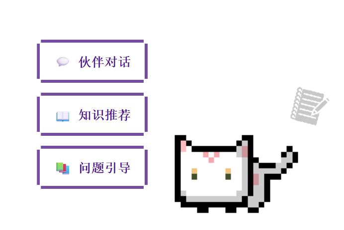
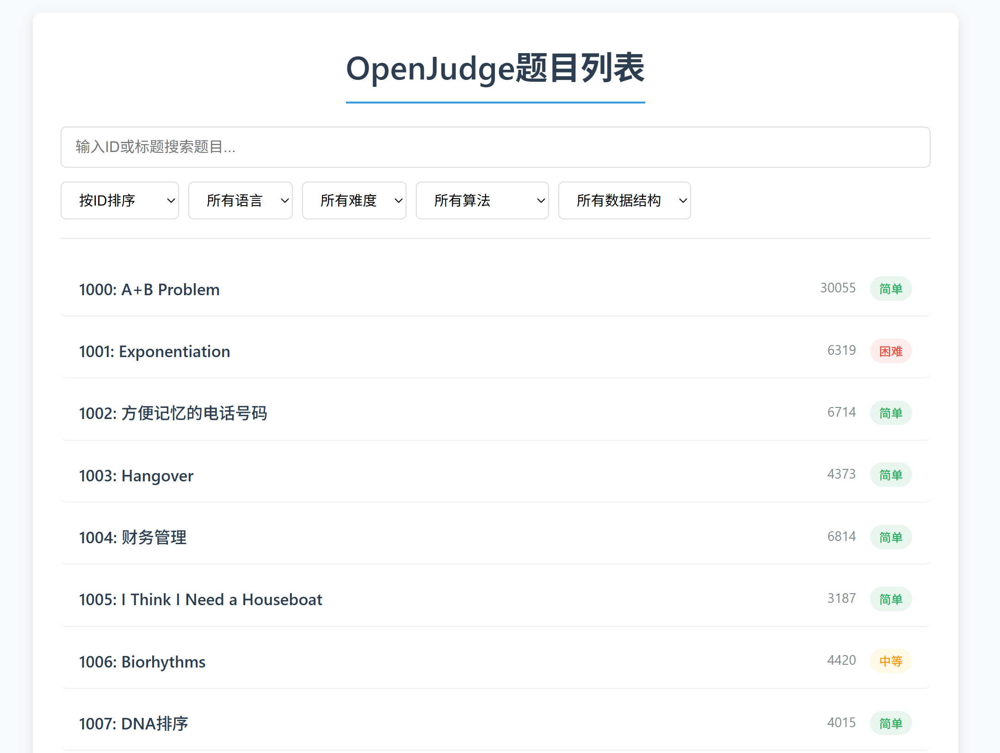
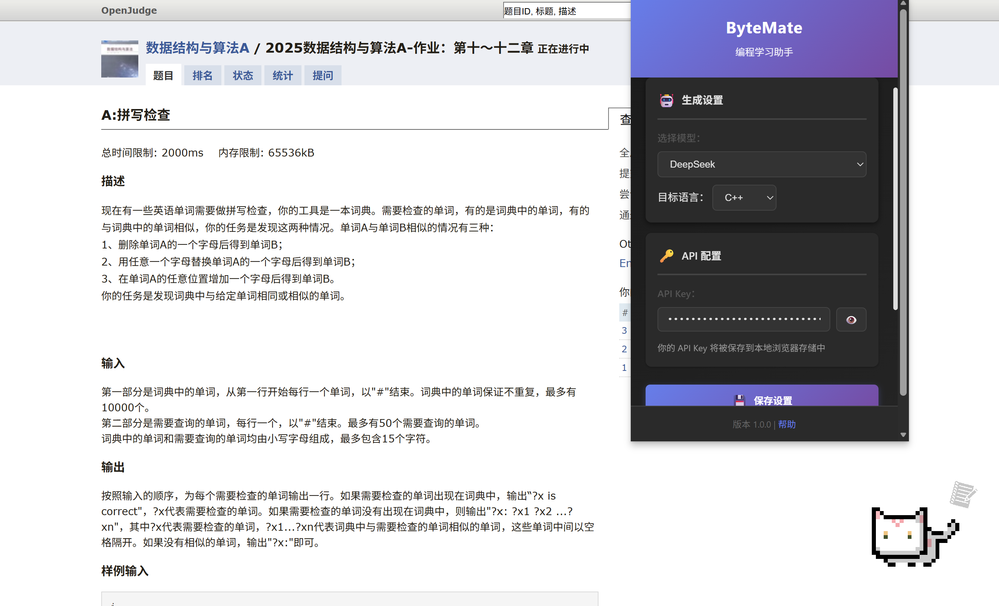
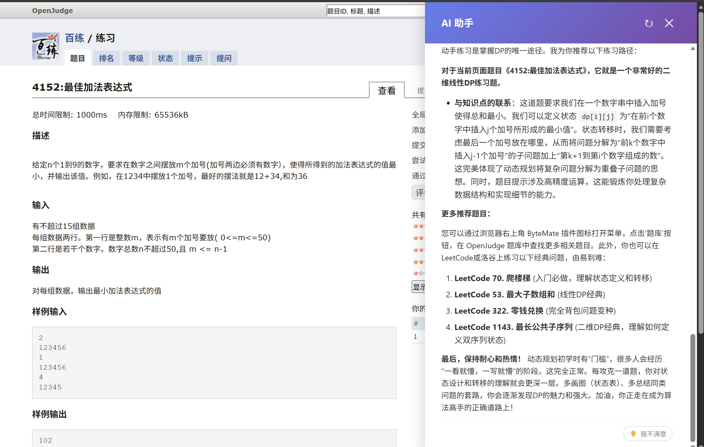
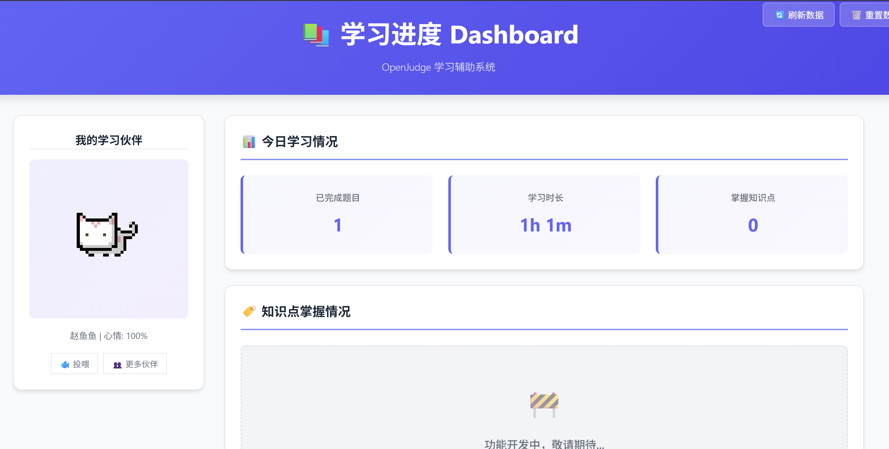

<div align="center">

# 🐾 POJPaw —— AI OpenJudge 学习伙伴 🐱
[![License][License-image]][License-url]
[![Releases][Releases-image]][Releases-url]
[![Chrome][Chrome-image]][Chrome-url]
[![Edge][Edge-image]][Edge-url]

🌐  **简体中文**
</div>

[License-image]: https://img.shields.io/github/license/LHS183019/ByteMate?style=flat-square&color=brown
[Releases-image]: https://img.shields.io/github/v/release/LHS183019/ByteMate?sort=semver&color=orange&label=Release
[Chrome-image]: https://img.shields.io/badge/Chrome-Extension-blue?style=flat-square&logo=google-chrome
[Edge-image]: https://img.shields.io/badge/Edge-Addon-blue?style=flat-square&logo=microsoft-edge

[License-url]: https://github.com/LHS183019/ByteMate/blob/pojpaw/LICENSE
[Releases-url]: https://github.com/LHS183019/ByteMate/releases
[Chrome-url]: #
[Edge-url]: #

---

## ✨ 最近更新 (v1.0.0 - 2025.12.18)
<div align="center">

| 类型       | 描述 |
| :--------- | :---------------------------- |
| 🏷️ 正式上线 | **POJPaw** 释放首个稳定版本 |

</div>


## 💡 即将上线

<details>
  <summary><b>更多功能正在开发中...</b></summary>

  + 👗 更丰富的宠物系统
  + 📊 Dashboard知识点总结和题目智能推荐
  + 🤖 更强大的AI助手
</details>

---

## 📝 项目介绍

**POJPaw** (by ByteMate Team) 是一个专为 OpenJudge 平台设计的 AI 编程学习助手 Chrome 扩展。它通过集成大语言模型（LLM），为学生提供实时的编程指导、思路提示、代码纠错和知识推荐，同时配备了可视化的学习仪表盘和电子宠物陪伴系统。

## ✨ 核心特性

### 🤖 智能辅助功能



*   **📚 问题引导 (Guide)**：像老师一样循循善诱，分步骤引导你思考解题方向，而不是直接给出答案。
*   **💡 思路提示 (Hint)**：当你卡壳时，提供关键的算法思路和逻辑提示。
*   **🔧 代码纠错 (Fix)**：分析你的代码错误，提供具体的修改建议。
*   **📖 知识推荐 (Recommend)**：根据当前题目，推荐相关的算法知识点和学习资源。
*   **💬 伙伴对话 (Chat)**：点击小猫进行简单的互动，获取鼓励和陪伴。

### 🖥️ 交互体验

*   **完整题库**：POJ完整题库检索

*   **纯客户端架构**：无需安装本地 Node.js 服务器，安装插件即用。
*   **多语言支持**：支持生成 **C++** 或 **Python** 代码，满足不同学习者的需求。

*   **悬浮小猫助手**：可爱的像素风小猫常驻页面，点击即可唤起功能菜单。
*   **侧边栏交互**：流畅的侧边栏动画，支持 Markdown 渲染、代码高亮和一键复制。

*   **用户反馈系统**：对 AI 回答不满意？一键反馈，帮助我们持续优化。

### 📊 学习仪表盘 (Dashboard)



*   **数据统计**：记录你的每日刷题量
*   **知识图谱**：可视化展示你已掌握的算法知识点。
*   **电子宠物**：随着你的学习进度成长，提供情感陪伴。

### 📈 智能遥测 (Telemetry)
*   **隐私安全**：使用匿名 ID，不收集任何个人身份信息。
*   **效能分析**：自动分析“复制 AI 代码”后的提交通过率，评估辅助效果。
*   **实时监控**：基于 Google Analytics 4 的实时系统状态监控。

更多可查看我们的[隐私政策](PRIVACY_POLICY.md)和[遥测系统文档](TELEMETRY.md)。

---

## 🚀 安装指南

### 方式一：拉取仓库，加载已解压的扩展程序（推荐开发/测试）

1.  **下载代码**：克隆本仓库或下载 [Released ZIP](https://github.com/LHS183019/ByteMate/releases) 包并解压。
2.  **打开扩展管理**：在 Chrome/Edge 浏览器地址栏输入 `chrome://extensions`/`edge://extensions` 打开扩展管理页面。
3.  **开启开发者模式**：打开右上角的“开发者模式”开关。
4.  **加载扩展**：点击左上角的“加载已解压的扩展程序”，选择本项目根目录（包含 `manifest.json` 的文件夹）。

### 方式二：浏览器扩展商店下载安装

1. 暂未通过审核


## ⚙️ 配置说明

安装完成后，点击浏览器右上角的插件图标（POJPaw 图标）打开设置面板：

1.  **选择模型**：暂时支持 DeepSeek, Qwen (通义千问) 
2.  **配置 API Key**：
    *   输入您的 API Key。
    *   或者**留空**，你仍然可以拷贝prompt到自己偏好的软件使用。
3.  **保存**：点击保存按钮，即可开始使用。

---

## 💻 开发环境配置（仅开发者）

> **注意**：普通用户**不需要**安装 Node.js，直接加载插件即可使用。以下步骤仅适用于需要运行单元测试或参与开发的贡献者。

本项目支持完整的单元测试（基于 Jest + JSDOM），且支持跨平台开发。

1.  **环境要求**：请确保已安装 [Node.js](https://nodejs.org/) (推荐 v18+)。
2.  **安装依赖**：
    ```bash
    npm install
    ```
3.  **运行测试**：
    ```bash
    npm test
    ```
    测试覆盖了 Popup 设置逻辑、侧边栏交互以及数据统计功能。

## 📂 项目结构

```
POJPaw/
├── manifest.json        // 扩展核心配置文件 (Manifest V3)
├── background/          // 后台服务 (Service Worker)
│   └── background.js    // 处理 API 请求、遥测、状态管理
├── content/             // 页面注入脚本
│   ├── content-script.js // 主要 UI 逻辑、DOM 操作
│   ├── result-check.js   // 提交结果检测
│   └── style.css         // 注入页面的样式
├── popup/               // 插件弹窗 (设置页)
├── dashboard/           // 仪表盘页面
├── api/                 // (已废弃) 旧版后端接口定义
├── assets/              // 图片资源 (UI图标、小猫动画)
├── prompts/             // Prompt 提示词模板
└── package_extension.sh // 打包脚本
```

## 🛠️ 开发说明

*   **架构变更**：本项目已从“插件+本地后端”迁移至**纯客户端架构**。所有 LLM API 调用均在 `background.js` 中通过 `fetch` 直接发起。
*   **遥测系统**：集成了 GA4 Measurement Protocol。相关配置位于 `background.js` 顶部。
*   **样式修改**：主要 UI 样式位于 `content/style.css`，采用 Shadow DOM 思想（但在 Content Script 中直接注入 CSS）以避免样式冲突。

## 🧪 单元测试

本项目包含完整的单元测试套件，覆盖了 Popup、Content Script、Background Service 和 Dashboard 的核心逻辑。

运行测试：
```bash
npm test
```

查看测试文档：[UNITTEXT.md](UNITTEXT.md)


## 🗺️ 打包安装

**Mac / Linux 用户:**
在终端运行：
```bash
./package_extension.sh
```
或者
```bash
bash package_extension.sh
```

脚本会在根目录生成 `POJPaw_Extension.zip`。将该 ZIP 文件发送给用户，解压后按照“方式一”加载即可。

**Mac/Linux 用户提示**:
1. 环境中没有下载 `zip`： 确保在unix/linux环境下运行 `sudo apt install zip` 安装。
2. 运行时遇到 `syntax error: unexpected end of file`： 可能是在 Windows 中编辑的脚本包含不兼容的换行符（CRLF），请使用 `vim` 修改格式：
```bash
vim package_extension.sh
:set ff=unix
:wq
```

**Windows 用户:**
在 PowerShell 中运行：
```powershell
.\package_extension.ps1
```

## 📝 贡献

欢迎提交 Issue 和 Pull Request！

---
*Last Updated: 2025-12-18*
