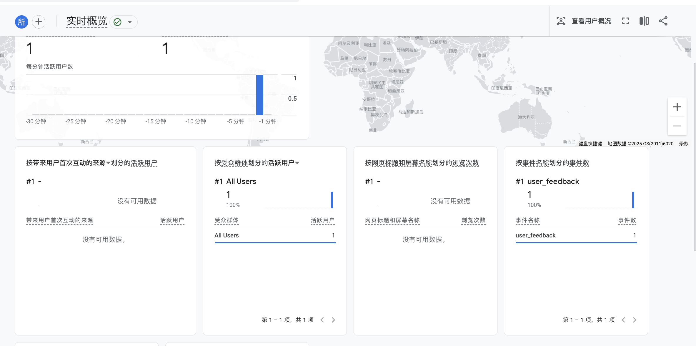

# 📊 ByteMate 遥测系统文档

本文档详细说明了 ByteMate 插件中集成的遥测（Telemetry）系统，用于追踪用户行为、分析 AI 模型效果以及监控系统稳定性。

## 1. 架构概述

本系统采用 **Google Analytics 4 (GA4) Measurement Protocol** 实现，具有以下特点：
*   **纯客户端**：无需自建后端服务器，直接从 Chrome Extension 的 Service Worker 发送数据到 Google 服务器。
*   **隐私安全**：使用随机生成的匿名 `client_id`，不收集用户个人身份信息（PII）。
*   **实时性**：数据通过 HTTP API 直接上报，支持实时概览。

### 数据流向
1.  **触发源**：用户在页面上的操作（点击按钮、复制代码、提交题目）或系统内部状态变化。
2.  **消息传递**：`content-script.js` 通过 `chrome.runtime.sendMessage` 将事件发送给后台。
3.  **统一上报**：`background.js` 中的 `sendTelemetryEvent` 函数接收事件，附加 `client_id` 和 `session_id`，通过 `fetch` 请求发送至 GA4。

---

## 2. 埋点指标详解

### 2.1 AI 功能使用 (AI Feature Usage)

用于分析用户最常使用的功能以及模型的响应性能。

| 事件名 (Event Name) | 触发时机 | 参数 (Params) | 说明 |
| :--- | :--- | :--- | :--- |
| `ai_feature_start` | 用户点击功能按钮时 | `feature`: 功能名 (guide/hint/fix) `model`: 使用的模型 (deepseek/gpt4) | 记录功能请求开始 |
| `ai_feature_success` | AI 成功返回结果时 | `feature`: 功能名 `model`: 使用的模型 `latency`: 耗时 (毫秒) | 用于监控模型响应速度 |
| `ai_feature_error` | AI 请求失败时 | `feature`: 功能名 `model`: 使用的模型 `error_type`: 错误类型 (auth_error/api_error) `error_message`: 错误信息摘要 | 用于监控系统稳定性 |

### 2.2 用户反馈 (User Feedback)

用于收集用户对 AI 回答质量的主观评价。

| 事件名 (Event Name) | 触发时机 | 参数 (Params) | 说明 |
| :--- | :--- | :--- | :--- |
| `user_feedback` | 用户点击"不满意"并选择原因时 | `feature`: 功能名 `reason`: 原因代码 | 原因代码包括： `code_error`: 代码无法运行 `bad_hint`: 提示不到位 `too_long`: 回答过长 `too_short`: 回答过短 |

### 2.3 代码行为与提交 (Code & Submission)

用于分析 AI 辅助对用户解题通过率的影响。

| 事件名 (Event Name) | 触发时机 | 参数 (Params) | 说明 |
| :--- | :--- | :--- | :--- |
| `code_copy` | 用户点击代码块的"复制"按钮时 | `length`: 代码长度 | 衡量代码被采纳的程度 |
| `code_submission` | 用户在 OJ 提交代码并获得结果时 | `result`: 判题结果 (Accepted/WA/TLE...) `problem_id`: 题目 ID `is_copied`: 是否为复制后提交 (`yes`/`no`) `time_since_copy`: 复制后经过的秒数 | **核心指标**：用于对比"直接复制AI代码"与"自己编写"的通过率差异。判定标准：提交时间距离上次复制代码小于 10 分钟。 |

---

效果：

## 3. 配置指南

目前在我的在 Google Analytics账号上绑定了网页插件，可以实时遥测网站的数据。
大家可以同样建立一个账号，把账号的邮箱发我，我来设置权限，让大家也可以遥测这个数据。

---

## 4. 数据分析建议

在 Google Analytics 的 **探索 (Explore)** 页面，您可以创建自定义报表来回答以下问题：

1.  **模型效果对比**：
    *   维度：`model`
    *   指标：`ai_feature_success` (计数), `latency` (平均值)
    *   *分析不同模型的响应速度和成功率。*

2.  **功能质量分析**：
    *   维度：`feature`, `reason` (仅限 `user_feedback` 事件)
    *   指标：`Event count`
    *   *找出哪个功能收到的负面反馈最多，以及主要原因是什么。*

3.  **AI 辅助效果分析 (核心)**：
    *   维度：`is_copied`, `result` (仅限 `code_submission` 事件)
    *   指标：`Event count`
    *   *对比 `is_copied=yes` 和 `is_copied=no` 的 `Accepted` 比例，判断 AI 提供的代码是否真的有效。*
