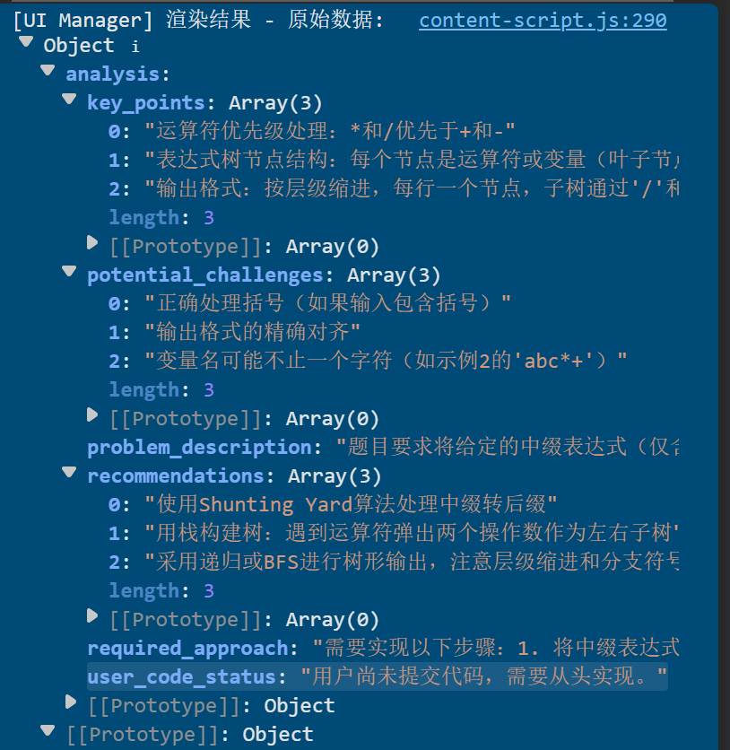
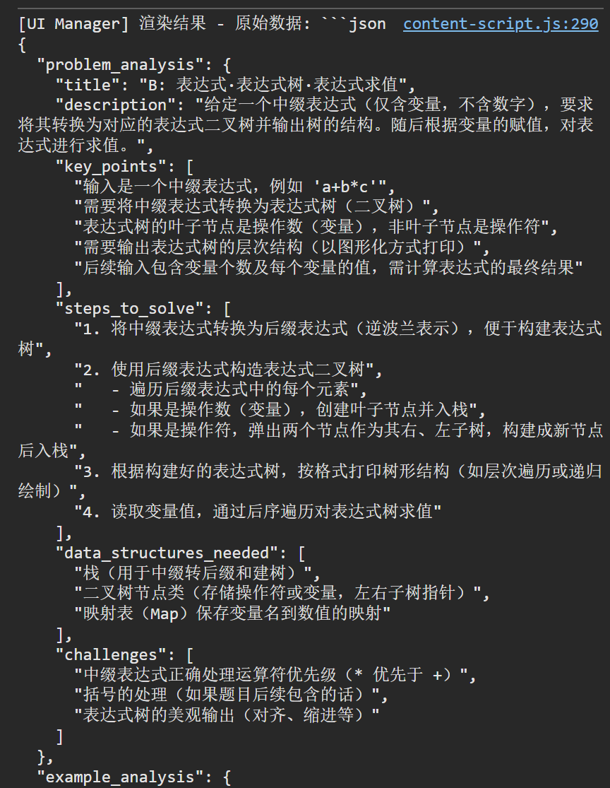
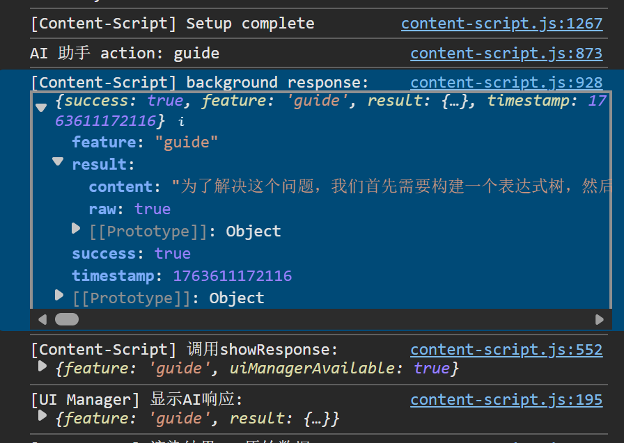

## LHS183019
- [x] 把右下角浮窗修改成待机小猫
- [x] 修改hover出现的menu的theme -> click on才会出现menu
- [x] 对后端返回结果的theme和交互方式进行修改，使其符合我们的设计
- [ ] 使支援多则历史记录查看和删除

## so many BUG!!

- [ ] 无法点开dashboard
- [ ] popup的设定无法更新到后台
- [ ] 后端无法正常返回结果(qwen请求貌似发送不成功, deepseek返回格式与zhipu不统一，只有zhipu works)
    - Deepseek返回格式：
    
    - Qwen返回格式：
    
    - ZhiPu返回格式：
    

- [x] 后端返回结果无法正确加载入前端
- [ ] dashboard和backend在api/storage.js的重复设计
    - 已经合并了两份的设计，但不确定是否能正常工作
