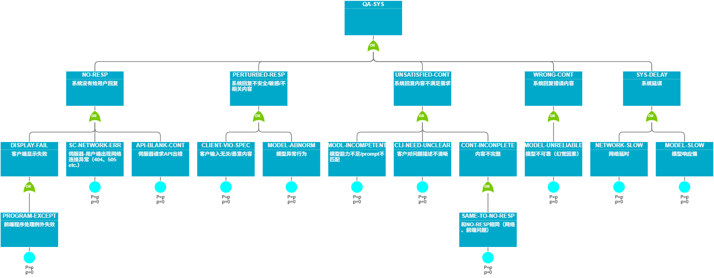
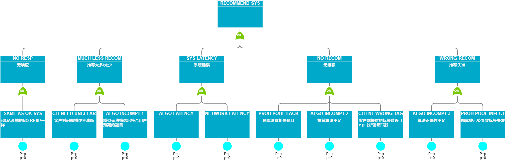
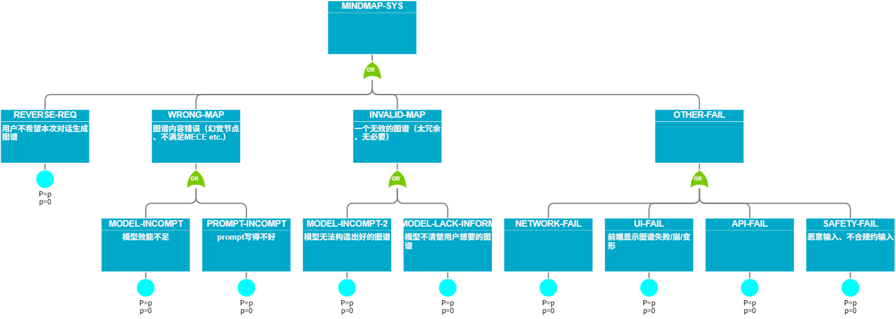

# 风险分析与应对方法

## 功能模块1——基础问答系统（QA-SYS）

### 功能概述

- 系统最基本的功能，用户输入一个问题，系统给出答复。

- 母系统实现方式：前端经典的Chat UI，后端调用语言大模型api，并预先做好prompt engineering

- 子功能模块列表
    
    - 普通问答

        - 课程PPT上传

        - 资料引用显示

        - 预设prompt库

        - 提问历史

        - 追问（是否限制Token长度？）

    - 代码问答（对代码编辑器中的/选中的代码提供自然语言解释）

    - 额外功能

        - 回答风格多选（e.g. 百科式/讲师式/brief/启发式）

就母系统主要功能进行如下风险分析：

### HAZOP启发式联想

+ 无(No)：系统无回应

+ 更多/更少 (More/Less)：系统回应太多/太少

+ 晚(Late)：系统响应过慢

+ 反向 (Reverse)：系统反问用户问题 / 系统的回答引发新的疑问

+ 其他/替代 (Other/Instead)：系统在闲聊，回应无关事情

+ 错误(Wrong)：系统回复错误答案

+ 无效(Invalid)：系统回复无法解决问题

+ 不完整(Incomplete)：系统回复不完整

+ 受扰动(Perturbed)：系统受用户不合规约的输入影响，回复不安全/敏感/不相关内容

### FAT障碍树分析

### 应对方法

+ 针对server-client网络错误、API请求错误、前端剖析错误等**内容传输过程**中出现的问题，设立容错机制进行**错误检测与修复**，如TTL内自动重新请求、及时为用户反馈错误情况令其进一步操作（Human-in-the-Loop）等。

+ 针对模型问题（出现不可靠内容、低效内容等），设置方便的用户反馈机制（点赞点踩、提供常用踩踩词条）

+ 针对客户端的不规范输入（恶意输入、无关输入），设置安全护栏，以避免恶意侵入并避免污染训练数据

+ 针对系统延时问题，需优化用户体验，使用流式响应并支持在背景工作等

## 功能模块2——相似题目推荐系统（RECOM-SYS）

### 功能概述

- 根据用户的需要，推荐指定难度、算法的练习题。

- 针对用户当前提问的题目，自动推荐难度、算法相似的练习题。

- 子模块：

    - 用户题集/错题集/往年题集

    - 系统自出题

- 母系统实现方式：

    - 题库：提前使用人工/自动化方法准备特定网站（编程网格/POJ/洛谷/leetcode等）题库，并标签每道练习题难易度和使用算法等的信息

    - 推荐系统算法：可以根据标签/题面比较两道题的相似程度
    
    - 整体流程：系统获取用户当前提问的题目，分析该题目的难易程度、使用算法等信息 / 直接根据用户提供的标签关键字，依据题库向用户推荐难度、算法相似的练习题

就母系统主要功能进行如下风险分析：

### HAZOP启发式联想

+ 无(No)：系统无响应/无推荐

+ 更多/更少 (More/Less)：系统推荐太多/太少

+ 晚(Late)：系统响应过慢

+ 错误(Wrong)：系统推荐不相关题目

+ 受扰动(Perturbed)：系统题库被污染，标签失准

### FAT障碍树分析

### 应对方法

- 内容传输过程、延时、用户违反规约问题和QA系统的处理方式一致

- 针对推荐失准，应该增加更多人在回路机制（反馈机制、用户手动选择算法标签）

- 针对题库维护问题（更新题库时可能有污染），做好错误检测（用户反馈及时移出）和隔离（每次更新时应该把新题和旧题隔离，有问题时方便追踪和维护）

## 功能模块3——知识图谱生成与维护系统（MINDMAP-SYS）

### 功能概述

- 生成知识关联图谱，以便用户梳理相关知识

    - 课程内容知识图谱

    - 辅助基础问答系统（e.g. 用户输入了某个库/某个类/某个函数，系统生成相应的知识图谱）

- 子模块：

    - 知识图谱节点交互（节点的知识总结小卡、把特定对话历史关联某个节点、点入节点开启特定面向复习的对话模式 etc.）

- 母系统实现方式：

    - 课程内容知识图谱应该由团队维护，确保结构最优

    - 辅助图谱：
        
        - 方式一：模型直接使用支持“格式化文本生图”的语言绘图，前端支持该语言的渲染

        - 方式二：令模型格式化输出至系统的某个绘图模块，前端处理绘图模块的输出
    
    - 应该有一个界面专门管理所有知识图谱及其交互

就母系统主要功能进行如下风险分析：

### HAZOP启发式联想

+ 系统无响应以及延时问题将不再复述

+ 反向 (Reverse)：用户不想要图谱

+ 错误(Wrong)：系统基于幻觉绘制图谱，绘制图谱失败

+ 无效(Invalid)：系统绘制图谱无助

### FAT障碍树分析

### 应对方法

- 人在回路

    - 支持用户编辑图谱

    - 重要图谱由开发团队绘制

    - 用户可选是否生成图谱 以及 图谱风格偏好

- 隔离：图谱生成不影响内容生成

- 错误侦测：用户反馈机制
